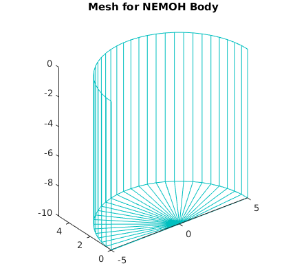
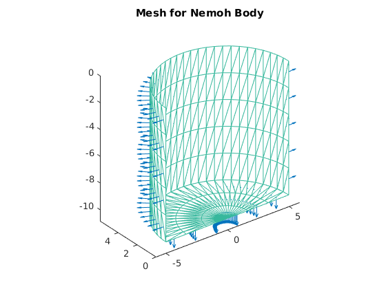

NEMOH
*****

The time domain simulator requires that you supply frequency domain
hydrodynamic coefficients derived from potential flow analysis. One
program capable of generating the required data is `NEMOH`_. NEMOH
is a Boundary Element Methods (BEM) code dedicated to the computation
of first order wave loads on offshore structures (added mass,
radiation damping, diffraction forces). It was been developed by
researchers at Ecole Centrale de Nantes for 30 years before being
released under a free software licence (`Apache v2`_).

.. _NEMOH: https://lheea.ec-nantes.fr/logiciels-et-brevets/nemoh-presentation-192863.kjsp?RH=1489593406974
.. _Apache v2: http://www.apache.org/licenses/LICENSE-2.0

Detailed information can be found at the project homepage linked above
and in academic papers, links for which can also be found at the project
homepage. This document focusses on the use of a Matlab preprocessor
which has been developed as part of the |TNShort| to ease the creation of
this data for WECs, rather than the details of what NEMOH produces.

NEMOH Preprocessor
==================

The Matlab preprocessor for NEMOH is based on an object oriented
approach. Two classes are used to describe the system to be simulated
a ``body`` class and a ``system`` class. The system class acts as a
container for one or more body objects and generates the Nemoh input
files. Like the |TNShort|, and MBDyn tools, the NEMOH classes are intended
to be a standalone package and as such are in their own `namespace`_ ``nemoh``.
This means the classes must be referenced using syntax like ``nemoh.body``
and ``nemoh.system``. The use of the preprocessor is best demonstrated
with a simple example, as shown in the listing below, which shows how to
simulate a simple cylinder using the NEMOH preprocessor.

.. literalinclude:: /examples/example_nemoh_cylinder.m
   :linenos:

This script can be broken down as follows. The fist section simply does
some Matlab magic to locate the directory containing the example file,
and create a subdirectory in that directory in which we will generate
the NEMOH input files from the Matlab description of the problem::

    % example_nemoh_cylinder.m
    %
    % Example file for nemoh package generating a basic cylinder
    %
    %

    dir = fileparts ( which ('example_nemoh_cylinder') );

    inputdir = fullfile (dir, 'Cylinder');

The next part creates the body for for which the hydrodynamics will be
solved. A simulation can be made up of multiple bodies, but here we will
just have the cylinder. In this case, the cylinder is specified using a 2D
profile from which a 3D mesh is generated by rotating it around the Z axis.
The method ``makeAxiSymmetricMesh`` is provided to accomplish this. See
the help for ``makeAxiSymmetricMesh`` for more details on how to specify
a mesh in this way.

Note also the use ``nemoh`` package namespace in the body creation command::

    %% create the Nemoh body

    % create a body object which will be the cylinder
    cylinder = nemoh.body (inputdir);

    n = 3; % 3 points are required for describing the shape
    raidus = 5; % Radius of the cylinder
    draft = -10; % Height of the submerged part
    r = [raidus  raidus  0];
    z = [0       draft   draft];
    ntheta = 30;
    verticalCentreOfGravity = -2;

    % define the body shape using a 3D profile rotated around the z axis
    cylinder.makeAxiSymmetricMesh (r, z, ntheta, verticalCentreOfGravity);

``makeAxiSymmetricMesh`` creates only a course representation of the mesh,
which must be refined by the Nemoh meshing program. However, at this point
we can draw the course mesh by calling the ``drawMesh`` method.::

    %% draw the course body mesh (will be refined later)

    cylinder.drawMesh ();
    axis equal;

The mesh is shown in :numref:`ex_cylinder_course_mesh`:

.. _ex_cylinder_course_mesh:

As can be seen, by default the symmetry of the body is taken advantage of
to reduce the computation time by calculating for only half the axisymmetric
mesh.

The next section creates a NEMOH simulation preprocessor object and puts
the body into it at the same time.::

    %% Create the nemoh simulation

    % here we insert the cylinder body at creation of the simulation, but could
    % also have done this later by calling addBody
    sim = nemoh.simulation ( inputdir, ...
                             'Bodies', cylinder );

Bodies don't have to added at this point, they can be also be added by calling
the ``nemoh.simulation.addBody`` method later, the 'Bodies' argument is optional.
The simulation has one non-optional argument, which is the input directory where
all NEMOH files will be generated.

The nest step writes mesh files for each of the bodies in the simulation (just
the cylinder in this case). This method calls the ``writeMesh`` method for each
body in the simulation.::

    %% write mesh files

    % write mesh file for all bodies (just one in this case)
    sim.writeMeshes ();

What is actually done by writeMesh depends on the type of mesh the body has.
For the axisymmetric mesh type it writes the course mesh description in a file
format understood by the NEMOH meshing program. The mesh program must be run
on the course mesh input file to generate the mesh file suitable for input to
the other NEMOH programs. To do this step, the ``processMeshes`` method is called.::

    %% process mesh files

    % process mesh files for all bodies to make ready for Nemoh
    sim.processMeshes ();

``processMeshes`` calls the ``processMesh`` method for every body in the
simulation. ``processMesh`` does any processing required for the body mesh to
create the appropriate input files for the other NEMOH programs. What this
processing actually is (if any) depends on the mesh type.

With the mesh files generated, we can draw the meshes again:::

    %% Draw all meshes in one figure

    sim.drawMesh ();
    axis equal;

The simulation ``drawMesh`` object draws the meshes for all bodies in the
simulation in one figure. The now refined cylinder mesh is shown in
:numref:`ex_cylinder_refined_mesh`:

.. _ex_cylinder_refined_mesh:

We can now proceed to generate the Nemoh input files. It is at this point that
the simulation parameters are provided.::

    %% Generate the Nemoh input file

    % generate the file for 10 frequencies in the range defined by waves with
    % periods from 10s to 3s.
    T = [10, 3];

    sim.writeNemoh ( 'NWaveFreqs', 10, ...
                     'MinMaxWaveFreqs', 2 * pi() *  (1./T) );

    % The above code demonstrates the use of optional arguments to writeNemoh
    % to set the desired wave frequencies. If the wave frencies were not
    % specified a default value would be used. These are not the only possible
    % options for writeNemoh. The following optional arguments are available,
    % and the defaults used if they are not supplied are also shown:
    %
    % DoIRFCalculation = true;
    % IRFTimeStep = 0.1;
    % IRFDuration = 10;
    % NWaveFreqs = 1;
    % MinMaxWaveFreqs = 0.8;
    % NDirectionAngles = 0;
    % MinMaxDirectionAngles = [0, 180];
    % FreeSurfacePoints = [0, 50];
    % DomainSize = [400, 400];
    % WaterDepth = 0;
    % WaveMeasurementPoint = [0, 0];
    %
    % For more information on these arguments, see the help for the writeNemoh
    % method.

As stated in the comments in the code section above, there are several optional
arguments which can be provided to control the calculation and details about
can be their use can be found in the help test for the
``nemoh.simulation/writeNemoh`` method.

The final step is to run the NEMOH on the input files::

    %% Run Nemoh on the input files

    sim.run ()

The ``run`` method first writes the small input.txt and ID.dat files required
by NEMOH, then runs the preProcessor, solver and postProcessor on the
generated input files. The hydrodynamic data will have been output to the usual
files produced by NEMOH.

The NEMOH Executables Location
==============================

It is worth noting that by default, the NEMOH interface described here assumes
that the NEMOH program files (called Mesh.exe, preProcessor.exe, Solver.exe and
postProcessor.exe on windows, and mesh, preProcessor, solver and postProcessor)
are installed somewhere on you computer such that you can run them just by typing
their name on the command line without giving their full path (i.e. they are on
the `program path`_). If this is not the case, e.g. you haven't installed them,
or you are testing more than one version of NEMOH installed in different
directories, you can specify the NEMOH install location when creating the
``nemoh.simulation`` object by using the optional ``'InstallDir'`` option. See
the help for the simulation constructor (``help nemoh.simulation/simulation``
for more details).

.. _namespace: https://uk.mathworks.com/help/matlab/matlab_oop/scoping-classes-with-packages.html
.. _program path: https://en.wikipedia.org/wiki/PATH_(variable)

